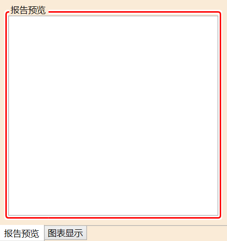
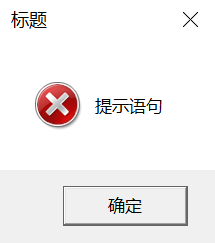
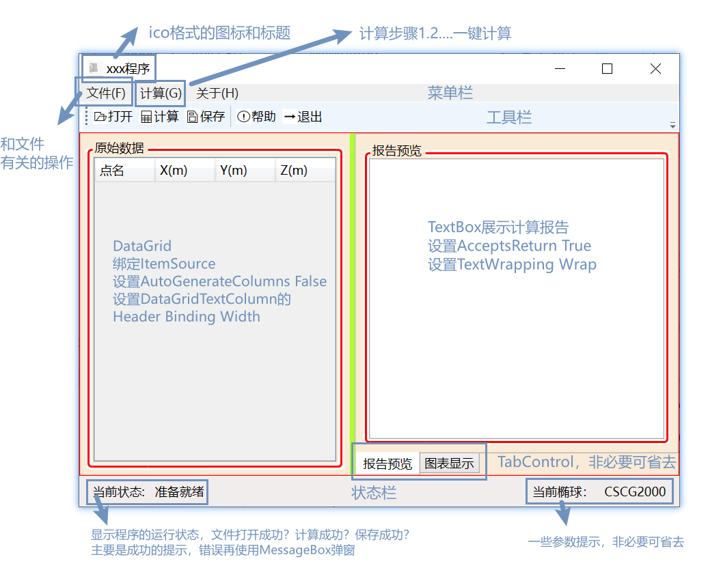
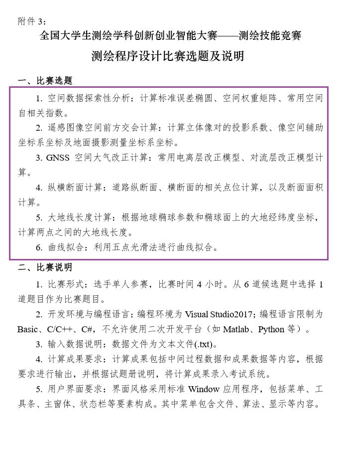

---
title:"C#WPF测绘程序设计简明教程"
date:"2024年5月"
---


# 致读者

## 简介

此教程主要是对标**测绘学科创新创智能大赛——测绘程序设计组**而编写，采用C# WPF技术结合MVVM(Model-View-ViewModel)设计模式进行.NET桌面应用程序设计，适合具有一些C#或者C/C++等编程经验的读者阅读，要求读者需要具有一些面向程序设计（类和对象）的概念。

全篇首先介绍了WPF界面常用控件，其目的是让读者快速了解WPF的界面设计模式；然后介绍了C#的基本操作，旨在让读者深入了解C#程序设计；随后结合笔者了解，简单介绍了测绘程序设计流程框架，让读者从无到有全面感受一个桌面应用程序的搭建；最后结合C#语言以及测绘数据的一些特点，给出一些编程注意事项，减少出错的机会。**需要注意的是**：由于本篇为简明教程，C#基本语法与C/C++等主流编程语言类似，XAML基本语法与HTML类似，故对C#、XAML简单的语法基础并未做描述。

由于笔者经验水平有限，难免出现一些错误和不足，还望读者批评指正，给出建议。

## 为什么选择WPF？

为什么选择WPF？这需要从测绘程序设计竞赛的角度出发：竞赛明文要求“编程语言限制为Basic、C/C++、C#，不允许使用二次开发平台（如Matlab、Python）”，就笔者所了解的而言，可以做界面的组合有：Basic、C++的MFC框架、C#的WinForm以及C#的WPF。

Basic语言是一门比较古老的编程语言，目前学习Basic的人少之又少，更别提测绘专业的学生了；C/C++基本是工科大学生的入门编程语言，其中C++的MFC框架可以做界面设计，但就笔者从《计算机图形学》课程中接触的MFC学习感受来说，难度很高。

C#作为微软公司发布的编程语言，其具有WinForm和WPF两种界面编程方式，笔者初次接触WinForm是做PIE二次开发，初次接触WPF是《测量程序设计》课程，直观的感受来说WinForm确实比WPF简单，最终选择WPF的原因如下：

1.   WPF使用XAML描述界面，布局的难度只是相对于初学者而言较困难，熟练掌握仍能在较短的时间内搭建出简洁美观的界面。
1.   WPF结合MVVM设计模式，通过数据绑定的方式驱动界面，省去了从界面取值和将结果展示到界面的环节，某种程度上减轻了C#代码编写的负担。
1.   WPF+MVVM是时代的潮流，可以做到前后端分离，程序架构更加清晰；XAML描述界面在Web、微信小程序开发等场景有着相似的方式；作为当代大学生更应不畏困难、了解WPF。

# WPF界面常用控件

## 公共控件

### Button（按钮）

>   描述

-   最基本的控件之一，可以结合StackPanel控件或者WrapPanel控件创建带图片的按钮。

>   重要属性

-   Click（点击触发事件）：针对事件驱动的点击响应事件。

-   **Command（命令）：针对MVVM模式的绑定命令。**

>   其他补充

-   **结合StackPanel控件创建带图标的按钮**
    在Button的子元素中放置StackPanel控件，在StackPanel控件中添加Image控件（存放图片）和TextBlock控件（存放按钮文字描述）即可实现带图标的按钮。

    ```xaml
    <Button>
        <StackPanel Orientation="Horizontal">
            <Image Source="../Resources/OpenFile2.bmp" Height="15" Width="15"/>
            <TextBlock Text="打开"/>
        </StackPanel>
    </Button>
    ```

    其中，`Orientation(朝向)`属性可以设置图片在按钮左边(Horizontal)还是按钮上方(Vertical)。

-   结合WrapPanel控件创建带图标的按钮
    与StackPanel类似，此处不多赘述。

    ```xaml
    <Button Command="{Binding CalCommand}">
        <WrapPanel>
            <Image Source="../Resources/Cal.bmp" Height="15" Width="15"/>
            <TextBlock Text="计算"/>
        </WrapPanel>
    </Button>
    ```

-   **Command属性绑定**
    View-Model类可以通过Command与Button进行绑定，从而实现交互。
    以绑定一个关闭窗口的Command为例，首先需要有一个继承自ICommand的MyCommands类[\(见MyCommands类\)](#MyCommands类)，在View-Model类中实现相应的Command属性如下：
    
    ```c#
    public void Close()
    {
        Application.Current.MainWindow.Close();
    }
    // 实现Command属性
    public ICommand CloseCommand =>
        new MyCommands((object p) => Close(), (object p) => true);
    ```
    
    到XAML界面进行Command绑定：
    
    ```xaml
    <ToolBar DockPanel.Dock="Top" Height="30">
        <Button Content="退出" Command="{Binding CloseCommand}" />
    </ToolBar>
    ```
    
-   Button去边框去底色变成透明

    ```xaml
    <Button Background="Transparent" BorderBrush="Transparent" Margin="100" Content="一个按钮"></Button>
    ```


### Label（标签）和TextBlock（文本块）

>   描述

Label和TextBlock都可以用来显示文本，相对而言，Label使用频率会搞一些。

>   重要属性

-   Content(Label)：用于绑定Label的文字
-   Text(TextBlock)：用于绑定TextBlock的文字
-   Height
-   Margin
-   FontSize

>   其他补充

-   **Content属性绑定**
    View-Model类可以将属性变量绑定到对应的控件，从而实现属性变量发生改变时，控件的属性也会随之改变。
    以Label作为状态栏文字显示控件绑定到View-Model类为例，首先需要一个继承自INotifyPropertyChanged的NotifyPropertyObject类[\(见NotifyPropertyObject类\)](#NotifyPropertyObject类)，在View-Model类中实现相应的属性如下：

    ```c#
    private string ltext = "准备就绪";
    
    public string Ltext
    {
        get { return ltext; }
        set { ltext = value; RaisePropertyChanged(); }
    }
    ```

    将属性绑定至界面如下

    ```xaml
    <StatusBar DockPanel.Dock="Bottom" Height="30">
        <StatusBarItem>
            <Label Content="{Binding Ltext}" Margin="10,0,0,0"/>
        </StatusBarItem>
    </StatusBar>
    ```

### TextBox（文本框）

>   描述

TextBox用来实现用户文本输入，以及文本展示，可以用来做报告显示。

>   重要属性

-   Text：显示的文本
-   **TextWrapping：**默认为`NoWrap`无法自动换行，设置成`Wrap`可以按照字符自动换行（会拆散单词），设置成`WrapWithOverflow`则是按照空格自动换行（不会拆散单词）。
-   **AcceptsReturn：**默认为`False`不接受用户输入回车换行符，设置成`True`接受输入回车换行符。

>   其他补充

-   利用TextBox+Group设置报告界面

    ```xaml
    <GroupBox Header="报告预览" Grid.Column="2">
        <TextBox Text="{Binding Report}" AcceptsReturn="True" TextWrapping="Wrap"/>
    </GroupBox>
    ```

### DataGrid（数据表格）

>   描述

DataGrid用以表格形式展示属于，可以用来做输入数据显示。

>   重要属性

-   ItemSource：用来绑定ObservableCollecion数据类型的变量
-   CanUserAddRows：设置成`False`可以去除最后一行。
-   AutoGenerateColumns：默认为`True`根据绑定的ItemSource自动生成列，设置成`False`可以添加子元素DataGrid.Columns自定义列。

>   其他补充

-   View-Model类设计属性同时绑定到DataGrid界面。
    在View-Model类中设计OvservableCollection属性：

    ```c#
    private ObservableCollection<MyPoints> data = new ObservableCollection<MyPoints>();
    
    public ObservableCollection<MyPoints> Data
    {
        get { return data; }
        set { data = value; RaisePropertyChanged(); }
    }
    ```

    其中，MyPoints需要自己定义一个类：

    ```c#
    public class MyPoints
    {
        public string Name { get; set; }
        public double X { get; set; }
        public double Y { get; set; }
        public double Z { get; set; }
    
        public MyPoints() { }
        public MyPoints(string name, double x, double y, double z)
        {
            this.Name = name;
            this.X = x;
            this.Y = y;
            this.Z = z;
        }
    }
    ```

    在XAML界面中绑定数据到DataGrid，**将子元素DataGridTextColumn的Width设置为1\*可以去除最后的空白列**：

    ```xaml
    <GroupBox Header="原始数据" Grid.Column="0">
        <DataGrid ItemsSource="{Binding Data}" Margin="2" AutoGenerateColumns="False" CanUserAddRows="False">
            <DataGrid.Columns>
                <DataGridTextColumn Header="点名" Binding="{Binding Name}" Width="1*"/>
                <DataGridTextColumn Header="X(m)" Binding="{Binding X,StringFormat={}{0:F3}}" Width="1*"/>
                <DataGridTextColumn Header="Y(m)" Binding="{Binding Y,StringFormat={}{0:F3}}" Width="1*"/>
                <DataGridTextColumn Header="Z(m)" Binding="{Binding Z,StringFormat={}{0:F3}}" Width="1*"/>
            </DataGrid.Columns>
        </DataGrid>
    </GroupBox>
    ```

### ComboBox（下拉框）

>   描述

下拉框，用户可以通过下拉框来调整预选的参数。

>   重要属性

-   ItemsSource：下拉选择的项，可以绑定椭球列表，需要在椭球类中实现ToString函数的重写以展示正常。
-   SelectedItem：选择的项，一般用作绑定当前椭球

>   其他补充

-   ComboBox绑定椭球
    椭球类的编写[\(见椭球类的简单实现\)](#椭球类的简单实现)

    View-Model类相关属性的设计

    ```c#
    //椭球列表
    private List<MyEllipsoid> ellipsoidList = EllipsoidFactory.EllipsoidList;
    
    public List<MyEllipsoid> EllipsoidList
    {
        get { return ellipsoidList = EllipsoidFactory.EllipsoidList; }
    }
    
    //当前椭球
    private MyEllipsoid currentEllipsoid = EllipsoidFactory.EllipsoidList[0];
    
    public MyEllipsoid CurrentEllipsoid
    {
        get { return currentEllipsoid; }
        set
        {
            currentEllipsoid = value;
            RaiseProperytChanged();
            RaiseProperytChanged(nameof(Rtext));
        }
    }
    ```

    XAML绑定属性

    ```xaml
    <ComboBox ItemsSource="{Binding EllipsoidList}" SelectedItem="{Binding CurrentEllipsoid}"/>
    ```

## 菜单、工具栏和状态栏

### Menu（菜单）

>   描述

配合DockPanel和MenuItem来制作菜单栏。

>   重要属性

-   Header：设置标题
-   DockPanel.Dock：设置锚定位置（需要是DockPanel的子元素）

>   其他补充

-   设计一组简单的菜单栏

    ```xaml
    <Menu DockPanel.Dock="Top">
        <MenuItem Header="文件(F)">
            <MenuItem Header="打开" Command="{Binding OpenFileCommand}"
                <MenuItem.Icon>
                    <Image Source="../Resources/OpenFile2.bmp"/>
                </MenuItem.Icon>
            </MenuItem>
            <MenuItem Header="保存" Command="{Binding SaveFileCommand}"
                <MenuItem.Icon>
                    <Image Source="../Resources/Save.bmp"/>
                </MenuItem.Icon>
            </MenuItem>
        </MenuItem>
        <MenuItem Header="计算(G)">
            <MenuItem Header="一键计算"/>
            <Separator/>
            <MenuItem Header="计算步骤1"/>
            <MenuItem Header="计算步骤2"/>
            <MenuItem Header="计算步骤..."/>
        </MenuItem>
        <MenuItem Header="关于(H)">
            <MenuItem Header="帮助">
                <MenuItem.Icon>
                    <Image Source="../Resources/Help.bmp"/>
                </MenuItem.Icon>
            </MenuItem>
            <MenuItem Header="退出">
                <MenuItem.Icon>
                    <Image Source="../Resources/Close.bmp"/>
                </MenuItem.Icon>
            </MenuItem>
        </MenuItem>
    </Menu>
    ```

### ToolBar（工具栏）

>   描述

工具栏，可以用于存放Button、ComboBox等小控件。

>   其他补充

-   工具栏设置带图标的Button[\(见Button\)](#Button（按钮）)

### StatusBar（状态栏）

>   描述

状态栏，用于展示程序的运行状态信息、一些参数信息。

>   重要属性

-   DockPanel.Dock
-   Height
-   子元素StatusBarItem的HorizontalAlignment属性

>   其他补充

-   状态栏设置左右文字

    >   核心思想：设置StatusBarItem的HorizontalAlignment属性分别为Left和Right。

    ```xaml
    <StatusBar DockPanel.Dock="Bottom" Height="30">
        <StatusBarItem HorizontalAlignment="Left" Margin="5,0,0,0">
            <WrapPanel>
                <Label Content="当前状态:"/>
                <Label Content="准备就绪"/>
            </WrapPanel>
        </StatusBarItem>
        <StatusBarItem HorizontalAlignment="Right" Margin="0,0,5,0">
            <WrapPanel>
                <Label Content="当前椭球："/>
                <Label Content="CSCG2000"/>
            </WrapPanel>
        </StatusBarItem>
    </StatusBar>
    ```

### 使用DockPanel组装一个简单界面

一个简单界面的完整性从上到下依次包括菜单栏、工具栏、功能展示区域、状态栏，此处给出一个DockPanel简单组装的界面。

```xaml
<DockPanel LastChildFill="True">
    <Menu DockPanel.Dock="Top">
        <MenuItem Header="文件(F)">
            <MenuItem Header="打开数据"/>
            <MenuItem Header="保存报告"/>
            <Separator/>
            <MenuItem Header="关于"/>
            <MenuItem Header="退出"/>
        </MenuItem>
        <MenuItem Header="计算(C)">
            <MenuItem Header="一键计算"/>
            <Separator/>
            <MenuItem Header="计算步骤1"/>
            <MenuItem Header="计算步骤2"/>
            <MenuItem Header="计算步骤3"/>
        </MenuItem>
    </Menu>
    
    <ToolBar DockPanel.Dock="Top" Height="30">
        <Button Content="打开"/>
        <Button Content="计算"/>
        <Button Content="保存"/>
        <Separator/>
        <Button Content="退出"/>
    </ToolBar>
    
    <StatusBar DockPanel.Dock="Bottom" Height="30">
        <StatusBarItem HorizontalAlignment="Left">
            <WrapPanel>
                <Label Content="状态:"/>
                <Label Content="准备就绪"/>
            </WrapPanel>
        </StatusBarItem>
    </StatusBar>
    
    <Border BorderBrush="Red" BorderThickness="2">
        <Grid Background="AntiqueWhite">
            <TextBox Margin="5"/>
        </Grid>
    </Border>
</DockPanel>
```

## 容器

### Border（边框）

>   描述

用于给某个元素绘制边框或者提供背景，是最简单的美化方式之一。

>   重要属性

-   BorderBrush：边框颜色
-   BorderThickness：边框的宽度
-   Margin：外边距
-   Padding：内边距
-   CornerRadius：圆角

>   其他补充

### Grid（网格）

>   描述

Grid的存在是WPF与WinForm布局的区别之一：通过Grid控件将整个窗体进行网格划分，再将对应的控件放置在对应的网格中，整个界面设计不仅更具条理，最重要的是界面大小发生变化时仍能保持合理的布局。

>   重要属性

-   Grid.Row、Grid.Column：指定子元素所在的行列，索引从0开始。
-   GridRowSpan、Grid.ColumnSapn：子元素跨多行多列。
-   BackGround

>   其他补充

### GroupBox（组合框）

>   描述

自带边框和文字的一个容器，可用与数据展示控件例如DataGrid和TextBox组合。

>   重要属性

-   Header：文字描述
-   BorderBrush：边框颜色
-   BorderThickness：边框宽度

### TabControl（选项卡）

>   描述

用于实现两页、三页的页面效果，配合TabItem进行分页设计。

>   重要属性

-   TabStripPlacement：选择框的位置，一般设置Bottom，放在下方。

>   其他补充

-   TabControl实现报告显示、图形显示

    ```xaml
    <TabControl Grid.Column="2" TabStripPlacement="Bottom" Background="AntiqueWhite">
        <TabItem Header="报告预览">
            <GroupBox Header="报告预览" Grid.Column="2">
                <TextBox Text="{Binding Report}" AcceptsReturn="True" TextWrapping="Wrap"/>
            </GroupBox>
        </TabItem>
        <TabItem Header="图表显示">
            <GroupBox Header="图表显示" Grid.Column="2">
                <Canvas Background="White"></Canvas>
            </GroupBox>
        </TabItem>
    </TabControl>
    ```

    效果图如下：
    

### WrapPanel（环绕面板）和StackPanel（堆栈面板）

>   描述

WrapPanel环绕面板，其子元素可以根据方向属性水平或垂直排列，当长度或高度不够时会自动调整进行换行。

StackPanel 堆栈面板，其子元素可以根据方向属性水平或垂直排列在一行中。

>   重要属性

-   Orientation：方向属性，StackPanel中默认是Vertical(垂直排列)，设置成Horizontal可以实现水平排列。而在WrapPenel中默认为水平排列。

>   其他补充

-   使用StackPanel排列带图标的工具栏按钮[(见Button（按钮）)](#Button（按钮）)

### DockPanel（停靠面板）

>   描述

定义一个区域用来对子元素设置Left、Top、Right、Bottom锚定。

>   重要属性

-   LastChildFill：最后一个元素是否填满整个Dock，默认为False，需要设置成True（最后一个元素默认填满整个Dock）。
-   DockPanel.Dock：为子元素设置停靠的方向(Left、Top、Right、Bottom)。

>   其他补充

-   使用DockPanel组装一个简单界面[使用DockPanel组装一个简单界面](#使用DockPanel组装一个简单界面)

## 其他

### Separator（分隔符）

>   描述

菜单栏、工具栏中的分隔符，用于简单美化。

### GridSplitter

>   描述

Grid中的分隔符，用户可以通过拖动该分隔符调整Grid区域大小。

>   重要属性

-   HorizontalAligment：竖向的分隔符需设置该属性为Stretch（拉伸）
-   Background

### OpenFileDialog和SaveFileDialog

>   描述

OpenFileDialog和SaveFileDialog用来弹出选择文件路径对话框，是桌面程序设计中与用户交互的重要组成部分。

>   用法

-   OpenFileDialog

    >   核心：从左上角到右下加思考对话框的内容：Title（标题）、Multiselect（多选）、Filter（过滤条件）；同时考虑用户不选择文件直接关闭对话框的情况。

    ```c#
    public void OpenFile()
    {
        OpenFileDialog ofd = new OpenFileDialog();
        ofd.Title = "选择数据文件"; //设置对话框标题
        ofd.Multiselect = false; //默认可以多选，设置不可多选
        ofd.Filter = "文本文件|*.txt|所有文件|*.*";//设置过滤条件
        if (ofd.ShowDialog() != true) { return; } //如果用户没有选择文件而关闭了对话框，则return
    
        using (StreamReader sr = new StreamReader(ofd.FileName))
        {
            MessageBox.Show(sr.ReadToEnd());
        }
    }
    
    public ICommand OpenFileCommand => new MyCommand(
        (object p) => OpenFile(), (object p) => true);
    ```

-   SaveFileDialog

    >   核心：与OpenFileDialog仅仅差一个AddExtension(自动添加拓展名）。

    ```C#
    public void SaveFile()
    {
        SaveFileDialog sfd = new SaveFileDialog();
        sfd.Title = "请选择文件保存路径";
        sfd.AddExtension = true;//自动添加文件拓展名
        sfd.Filter = "文本文件|*.txt";
        if (sfd.ShowDialog() != true) { return; }
    
        using (StreamWriter sw = new StreamWriter(sfd.FileName))
        {
            sw.WriteLine("保存的文本");
        }
    }
    
    public ICommand SaveFileCommand => new MyCommand(
        (object p) => SaveFile(), (object p) => true);
    ```

### MessageBox

>   描述

MessageBox用来弹出消息提示框，同时也可以用来做调试输出。在桌面程序设计中主要是给出一些必要的弹窗提示，例如错误提示和关键步骤正确提示。

>   用法

```c#
private void Button_Click(object sender, RoutedEventArgs e)
{
    MessageBox.Show("提示语句", "标题", MessageBoxButton.OK, MessageBoxImage.Error);
}
```

效果图片：



# C#基本操作

此章节主要是介绍C#的基本操作，包括读写文本文件、数据类型的相互转换、字符串处理等等，同时给出了一些测绘常见的函数代码： 

## 读写文本文件

### 使用StreamReader类读取文本文件

>   核心语句

-   `StreamReader sr = new StreamReader(FilePath);`
-   `string AllText = sr.ReadToEnd();`
-   `string Line = sr.ReadLine();`

```c#
string FilePath = @"D:\ADesktop\Southern Survey and Mapping\2024\MyWpfApp\LuoGu\测试数据.txt";
using (StreamReader sr = new StreamReader(FilePath))
{
    string AllText = sr.ReadToEnd();//一次读完，同时文件指针指向文末，即再次用该对象读取时为null
    Console.Write(AllText);
}
using (StreamReader sr = new StreamReader(FilePath))
{
    string Line = sr.ReadLine(); //一次读取一行，同时文件指针指向行末
    while (Line != null)
    {
        Console.Write(Line);
        Line = sr.ReadLine();
    }
}
```

### 使用StreamWriter类写入文本文件

>   核心语句

-   `sw.WriteLine(string.Join(",", myData[i].ConvertAll(t => t.ToString("f4"))));`

```c#
string SavePath = @"D:\ADesktop\Southern Survey and Mapping\2024\MyWpfApp\LuoGu\SaveFile.txt";
using (StreamWriter sw = new StreamWriter(SavePath))
{
    // 为了模拟真实表格情况，用循环生成数据写入文件
    // 生成数据
    List<List<double>> myData = new List<List<double>>();
    for (int i = 0; i <= 360; i += 1)
    {
        double i_rad = i*1.0 / 180.0 * Math.PI;
        List<double> tempList = new List<double>();
        tempList.Add(i);
        tempList.Add(Math.Sin(i_rad));
        tempList.Add(Math.Cos(i_rad));
        tempList.Add(Math.Tan(i_rad));
        myData.Add(tempList);
    }
    // 写入文件
    sw.WriteLine(string.Join(",", new string[] { "角度（°）", "正弦", "余弦", "正切" }));
    for (int i = 0; i < myData.Count; i++)
    {
        sw.WriteLine(string.Join(",", myData[i].ConvertAll(t => t.ToString("f4"))));
    }
}
```

## 数据类型的相互转换

string类型要转为int或者double类型才可以做数值运算。笔者推荐能用double就不要用int，因为在C#中int在与int运算的结果仍为int，会影响计算精度。

>   字符串转数字

1.   使用Parse方法

     ```c#
     string myString = "1314.0";
     double myDouble = double.Parse(myString);
     int myInt = int.Parse(myString);
     long myLongInt = Int64.Parse(myString);//长整型
     ```

2.   使用Convert类

     ```c#
     string myString = "1314.0";
     double myDouble = Convert.ToDouble(myString);
     int myInt = Convert.ToInt32(myString);
     long myLongInt = Convert.ToInt64(myString);//长整型
     ```

>   数字转字符串

1.   使用\$符号

     ```
     int myInt = 1314;
     string myString = $"{myInt}";
     ```

2.   使用ToString方法

     ```C#
     int myInt = 1314;
     string myString = myInt.ToString();
     ```

3.   使用Convert类

     ```c#
     int myInt = 1314;
     string myString = Convert.ToString(myInt);
     ```

## 字符串的处理

### 字符串分割

字符串分割是指对一个字符串例如

```c#
string s = "Python,Matlab,C/C++,C#,R";
string[] fruits = s.Split(','); // 按照逗号分割字符串
foreach (string fruit in fruits)
{
    Console.WriteLine(fruit);
}
```

### 字符串取子串

>   核心语句

-   `string s1 = s.Substring(0,6); //从位置0开始向后取6位，包括位置0`
-   `string s2=s.Substring(6);//从索引6(绘)位置开始到结束，包括索引6`

```c#
string s = "测神州经纬，绘祖国蓝图!";
string s1 = s.Substring(0,6); //从位置0开始向后取6位，包括位置0
string s2=s.Substring(6);//从索引6(绘)位置开始到结束，包括索引6
Console.WriteLine(s1);
Console.WriteLine(s2);
Console.WriteLine(string.Join("", new string[] { s1, s2 }));
```

### 字符串拼接

>   使用加法运算符

```c#
string a = "Hello";
string b = "C#";
string c = "I'm little y";
string result = a + " " + b + "\n" + c;
Console.WriteLine(result);
```

>   使用\$符号

```c#
string a = "Hello";
string b = "C#";
string c = "I'm little y";
string result = $"{a} {b}\n{c}";
Console.WriteLine(result);
```

### 格式化字符串

格式化字符串是指对字符串保留一定的格式，例如保留两位小数、保留两位有效数字等等，此处仅说明常用的保留两位小数的方法。https://www.cnblogs.com/perfect-long/p/12799309.html。

>   使用string.Format()函数

```c#
//使用零占位符0和数字占位符#
Console.WriteLine(string.Format("{0:00.###}", a));//03.14
Console.WriteLine(string.Format("{0:00.000}", a));//03.140
```

>   使用\$符号

```c#
Console.WriteLine($"{a:00.###}");//03.14
Console.WriteLine($"{a:00.000}");//03.140
```

### 其他字符串方法

```
string.Trim();
```


## 数组

### 固定数组Array

需要注意的是：此处的Array与ArrayList不同，Array是固定数组，ArrayList是非泛型的动态数组。

>   定义和初始化

```c#
int[] num1 = new int[10];
int[] num2 = new int[] { 1, 2, 3 };
```

>   常用方法

```c#
int len = num2.Length;
double sum = num2.Sum();//数组求和
double average = num2.Average();//数组平均值
double numMax = num2.Max();//最大值
double numMin = num2.Min();//最小值
bool isContain=num2.Contains(2.0);//是否包含某个值
```

>   数组排序

-   Array.Sort()：用于数组升序排序。
-   Array.Reverse()：用于数组颠倒，例如[1,2,4,3]变成[3,4,2,1]。结合Array.Sort()可以对数组降序排序。

```c#
double[] num1 = new double[] { 1, 2, 3, 4, 5, 10, 9, 3, 2 };
Array.Sort(num1);
foreach (double i in num1)
{
    Console.WriteLine($"{i}");
}
Array.Reverse(num1);

Console.Write(string.Join(" ", num1.ToList().ConvertAll(s => s.ToString())));//一行打印数组元素
```

### 泛型数组List

>   定义和初始化

```c#
//先定义，后赋值
List<double> num1 = new List<double>();
num1.Add(1); num1.Add(2);
num1.AddRange(new double[] { 1, 3, 1, 4 }); //添加一组Array
num1.AddRange(num1); //添加自己

List<double> num2 = new List<double> { 1, 2, 3, 2, 3, 5 };
```

>   常用方法

```c#
List<double> myList = new List<double> { 1, 2, 3, 5, 7, 12, 3, 21 };
myList.Add(1314);//在末尾添加一个元素
myList.AddRange(new double[] { 1, 2, 3, 4, 5 });//在末尾添加多个元素
bool IsExist = myList.Contains(1314); //一个元素是否在数组内
myList.Insert(0, 12);//在0号索引插入元素12
myList.Remove(1314);//移除匹配的第一个元素
myList.Sort();//升序排序
myList.RemoveAt(myList.Count - 1);//移除最后一个索引元素

myList.Clear(); //移除所有元素
```

>   泛型数组List与固定数组Array互转

```c#
//List->Array
List<double> myList1 = new List<double> { 1.0, 2.0, 3.0, 1.0 };
double[] myArray1 = myList.ToArray();

//Array->List
double[] myArray2 = new double[] { 1.0, 2.0, 3.0, 5.0 };
List<double> myList2 = myArray.ToList();
```


>   **List\<int\>与List\<string\>互转**

通过ConvertAll方法结合Lambda表达式，可以批量转换List中元素的数据类型，避免使用for循环。

```c#
//List<int> -> List<string>
List<int> myListInt1 = new List<int> { 1, 2, 3, 4, 2, 3, 5 };
List<string> myListString1 = myListInt1.ConvertAll(t => t.ToString());

//List<string> -> List<int>
List<string> myListSrting2 = new List<string> { "1", "2", "3" };
List<int> myListInt2 = myListSrting2.ConvertAll(t => int.Parse(t));
```

>   List转字符串

通过string.Join()方法，可以将List数组元素连接成字符串。如此可以避免循环，在生成文字报告时很有用。

1.   List\<string\>转字符串

     ```c#
     List<string> myList = new List<string> { "一生一世", "我爱你", "!" };
     string myListToString = string.Join("", myList);
     Console.WriteLine(myListToString);
     ```

2.   List\<int>转字符串
     C#中，List\<int\>可以直接使用string.Join()方法转为字符串，不需要转为List\<string\>，这一点与Python略有区别。

     ```c#
     List<int> myListInt = new List<int> { 1, 3, 1, 4, 5, 2, 0 };
     string myListIntToString = string.Join("", myListInt);
     Console.WriteLine(myListIntToString);
     ```

3.   将一个二维数据表转为CSV格式的文本

     ```c#
     List<List<double>> myData = new List<List<double>>();
     //制造数据
     for (int i = 0; i < 10; i++)
     {
         myData.Add(new List<double> { i, Math.Sqrt(i), Math.Pow(i, 2) });
     }
     //转为CSV
     string myCSV = string.Join("\n", myData.ConvertAll(t => string.Join(",", t)));
     Console.WriteLine(myCSV);
     ```

很容易联想到：如果是Array数组，可以先使用ToList()方法转为List，再使用string.Join()方法转为字符串即可，读者可以自行尝试。

## 一些测绘代码

### 角度转化

>   从浮点数dd.mmsss中无损精度提取度、分、秒

无损精度提取的核心是将dd.mmsss乘10000后用其整数部分进行提取。

```c#
/// <summary>
/// 无损精度的从浮点数dd.mmsss->(d,m,s)
/// </summary>
/// <param name="ddmmss"></param>
/// <returns></returns>
public static (int d, int m, double s) DDMMSSToDMS(double dmsAngle)
{
    //13.14521
    dmsAngle = dmsAngle * 10000.0;//131452.1
    int myAngle = (int)dmsAngle;//131452
    int d = myAngle / 10000; //int(13.1452)
    int m = (myAngle - d * 10000) / 100; //int(14.52)
    double s = dmsAngle - d * 10000 - m * 100;
    return (d, m, s);
}
```

>   度、分、秒与度的互化

1.   度、分、秒转为度

     ```C#
     /// <summary>
     /// 度、分、秒->度
     /// </summary>
     /// <param name="d"></param>
     /// <param name="m"></param>
     /// <param name="s"></param>
     /// <returns></returns>
     public static double DMSTODEG(double d, double m, double s)
     {
         return (d + m / 60.0 + m / 60.0 + s / 3600.0);
     }
     ```

2.   度转为度、分、秒

     ```c#
     /// <summary>
     /// 度->度、分、秒
     /// </summary>
     /// <param name="deg"></param>
     /// <returns></returns>
     public static (int d, int m, double s) DEGTODMS(double deg)
     {
         deg = deg * 3600;//转为秒
         int angle = (int)deg;
         int d = angle / 3600;//提取度
         angle -= d * 3600;
         int m = angle / 60;//提取分
         double s = deg - d * 3600.0 - m * 60.0;//提取秒
         return (d, m, s);
     }
     ```

>   度与弧度的互化

1.   度转化为弧度

     ```c#
     public static double DEGToRAD(double DEG)
     {
         return DEG / 180 * Math.PI;
     }
     ```

2.   弧度转化为度

     ```c#
     public static double RADToDEG(double RAD)
     {
         return RAD / Math.PI * 180;
     }
     ```

### 椭球类的简单实现

```C#
public class MyEllipsoid
{
    public string name;
    public string id;
    public double a;    //长半轴
    public double b;    //短半轴
    public double e_2;
    public double e1_2;

    private MyEllipsoid(string name, string id, double a, double b, double e_2, double e1_2)
    {
        this.name = name;
        this.id = id;
        this.a = a;
        this.b = b;
        this.e_2 = e_2;
        this.e1_2 = e1_2;
    }
    public override string ToString()
    {
        return this.name;
    }

    public static MyEllipsoid CreateK()
    {
        return new MyEllipsoid("克拉索夫斯基椭球", "K", 6378245, 6378245.0, 0.00669342162297, 0.00673852541468);
    }

    public static MyEllipsoid CreateIUGG1975()
    {
        return new MyEllipsoid("IUGG1975椭球", "IUGG1975", 6378140, 6378140.0, 0.00669438499959, 0.00673950181947);
    }

    public static MyEllipsoid CreateCGCS2000()
    {
        return new MyEllipsoid("CGCS2000椭球", "CGCS2000", 6378137, 6378137.0, 0.00669438002290, 0.00673949677548);
    }
}
```

### 坐标方位角计算函数

>   核心：使用Atan2函数，其返回值在$-\pi$  ~ $ \pi$之间，其一二象限返回值与坐标方位角一二象限定义一直，三四象限(dy<0)与坐标方位角差一个$2\pi$。

```c#
public static double Az2(MyPoint p1, MyPoint p2)
{
    double dx = p2.X - p1.X;
    double dy = p2.Y - p1.Y;
    return Math.Atan2(dy, dx) + (dy < 0 ? 1 : 0) * 2 * Math.PI;
}
```


# 测绘程序设计流程框架

## 新建项目

-   WPF应用程序
-   框架.NET Framework 4.7.2（可以默认选）

## 整理创建必要的文件夹和文件

-   Resources文件夹，存放后期设计图标文件。
-   Commands文件夹，存放MyCommand.cs类文件。
-   ViewModels文件夹，存放ViewModel类、NotifyPropertyObject类，创建MainWindowVM类，改public，添加空的构造函数。
-   Views文件夹，存放xml文件，更改App.config中的路径。
-   Models文件夹，存放必要的算法类、数据结构类。
-   经上述操作后，生成一下项目，确保此时可以正常运行。

## 编写MyCommands类和NotifyPropertyObject类

### MyCommands类

改public权限，继承自ICommand，根据提示引用System.Windows.Input命名空间、实现接口。增加readonly权限的`_execute`和`_canExecute` 成员，实现构造函数。

```c#
using System;
using System.Collections.Generic;
using System.Linq;
using System.Text;
using System.Threading.Tasks;
using System.Windows.Input;

namespace MyWpfApp.Commands
{
    public class MyCommands : ICommand
    {
        public event EventHandler CanExecuteChanged;
        public readonly Action<object> _execute;
        public readonly Predicate<object> _canExexute;

        public MyCommands(Action<object> execute, Predicate<object> canExecute)
        {
            this._execute = execute;
            this._canExexute = canExecute;
        }

        public bool CanExecute(object parameter)
        {
            return _canExexute(parameter);
        }

        public void Execute(object parameter)
        {
            _execute(parameter);
        }
    }
}
```

### NotifyPropertyObject类

改public权限，继承自INotifyPropertyChanged，根据提示引用System.ComponentModel命名空间。编写RaisePropertyChanged函数，根据提示引用System.Runtime.CompilerServices命名空间

```C#
using System;
using System.Collections.Generic;
using System.ComponentModel;
using System.Linq;
using System.Runtime.CompilerServices;
using System.Text;
using System.Threading.Tasks;

namespace MyWpfApp.Models
{
    public class NotifyPropertyObject : INotifyPropertyChanged
    {
        public event PropertyChangedEventHandler PropertyChanged;

        public void RaisePropertyChanged([CallerMemberName] string propertyName = "")
        {
            PropertyChanged?.Invoke(this, new PropertyChangedEventArgs(propertyName));
        }
    }
}
```

## View-Model类的编写

-   设置public，继承NotifyPropertyObject类，设置构造函数
-   使用#region创建界面属性、私用变量、Commands区域

-   利用propfull，依次设置FileName，Title，LStatus，Report，ObservableCollection(命名空间System.Collections.ObjectModel)等通用的属性

## 必要类的编写

-   对于数据含点的，应设计一个点类，包含无参构造函数和带参构造函数，甚至是点与点之间的距离与方位角的计算。
-   对于需要角度计算的，应设计SurMath类，编写静态的计算函数。
-   对于椭球相关的计算，需要设计椭球类，用以存放椭球的相关信息（ID，Name，两轴，两偏心率），必要时应设置一些自定义椭球的构造函数。

## WPF窗口设置

### 添加ViewModels所在的命名空间

```xaml
xmlns:vm="clr-namespace:MyWpfApp.ViewModels"
```

### 设置DataContext环境

```xaml
<Window.DataContext>
	<vm:MainWIndowVM/>
</Window.DataContext>
```

### 编写XAML界面

>   颜色推荐：AntiqueWhite（背景）、GreenYellow（边框or背景）、Red（边框）三种

>   Window标签的设置

-   设置窗体图标，Window的Icon资源属性，注意相对路径从xaml文件开始计算，图标只能为Icon格式。
-   可以设置WindowStartupLocation="CenterScreen"属性使得程序开始时位于屏幕中央
-   可以设置WindowState="Maximized"属性默认最大化启动窗口

>   界面设计思路



>   XAML模板代码(仅供参考)

```xaml
<Window x:Class="MyWpfApp.MainWindow"
        xmlns="http://schemas.microsoft.com/winfx/2006/xaml/presentation"
        xmlns:x="http://schemas.microsoft.com/winfx/2006/xaml"
        xmlns:d="http://schemas.microsoft.com/expression/blend/2008"
        xmlns:mc="http://schemas.openxmlformats.org/markup-compatibility/2006"
        xmlns:local="clr-namespace:MyWpfApp"
        xmlns:vm="clr-namespace:MyWpfApp.ViewModels"
        mc:Ignorable="d"
        Title="{Binding Title}" Height="450" Width="600"  Icon="../Resources/Icon1.ico" WindowStartupLocation="CenterScreen" 
        WindowState="Maximized">

    <Window.DataContext>
        <vm:MainWIndowVM/>
    </Window.DataContext>

    <Window.Resources>
        <Style TargetType="GroupBox">
            <Setter Property="BorderThickness" Value="2"/>
            <Setter Property="BorderBrush" Value="Red"/>
            <Setter Property="Margin" Value="5"/>
        </Style>

    </Window.Resources>

    <DockPanel LastChildFill="True">
        <Menu DockPanel.Dock="Top">
            <MenuItem Header="文件(F)">
                <MenuItem Header="打开" Command="{Binding OpenFileCommand}">
                    <MenuItem.Icon>
                        <Image Source="../Resources/OpenFile2.bmp"/>
                    </MenuItem.Icon>
                </MenuItem>
                <MenuItem Header="保存" Command="{Binding SaveFileCommand}">
                    <MenuItem.Icon>
                        <Image Source="../Resources/Save.bmp"/>
                    </MenuItem.Icon>
                </MenuItem>
            </MenuItem>
            <MenuItem Header="计算(G)">
                <MenuItem Header="一键计算"/>
                <Separator/>
                <MenuItem Header="计算步骤1"/>
                <MenuItem Header="计算步骤2"/>
                <MenuItem Header="计算步骤..."/>
            </MenuItem>
            <MenuItem Header="关于(H)">
                <MenuItem Header="帮助">
                    <MenuItem.Icon>
                        <Image Source="../Resources/Help.bmp"/>
                    </MenuItem.Icon>
                </MenuItem>
                <MenuItem Header="退出">
                    <MenuItem.Icon>
                        <Image Source="../Resources/Close.bmp"/>
                    </MenuItem.Icon>
                </MenuItem>
            </MenuItem>
        </Menu>
        <ToolBar DockPanel.Dock="Top" Height="30">
            <Button Command="{Binding OpenFileCommand}">
                <StackPanel Orientation="Horizontal">
                    <Image Source="../Resources/OpenFile2.bmp" Height="15" Width="15"/>
                    <TextBlock Text="打开"/>
                </StackPanel>
            </Button>

            <Button Command="{Binding CalCommand}">
                <WrapPanel>
                    <Image Source="../Resources/Cal.bmp" Height="15" Width="15"/>
                    <TextBlock Text="计算"/>
                    <TextBlock/>
                </WrapPanel>
            </Button>

            <Button Command="{Binding SaveFileCommand}">
                <WrapPanel>
                    <Image Source="../Resources/Save.bmp" Width="15" Height="15"/>
                    <TextBlock Text="保存"/>
                </WrapPanel>
            </Button>
            <Separator/>
            <Button>
                <WrapPanel>
                    <Image Source="../Resources/Help.bmp" Width="15" Height="15"/>
                    <TextBlock Text="帮助"/>
                </WrapPanel>
            </Button>
            <Button>
                <WrapPanel>
                    <Image Source="../Resources/Close.bmp" Width="15" Height="15"/>
                    <TextBlock Text="退出"/>
                </WrapPanel>
            </Button>
        </ToolBar>

        <StatusBar DockPanel.Dock="Bottom" Height="30">
            <StatusBarItem HorizontalAlignment="Left" Margin="5,0,0,0">
                <WrapPanel>
                    <Label Content="当前状态:"/>
                    <Label Content="准备就绪"/>
                </WrapPanel>
            </StatusBarItem>
            <StatusBarItem HorizontalAlignment="Right" Margin="0,0,5,0">
                <WrapPanel>
                    <Label Content="当前椭球："/>
                    <Label Content="CSCG2000"/>
                </WrapPanel>
            </StatusBarItem>
        </StatusBar>


        <Border Background="AntiqueWhite" BorderBrush="Red"  BorderThickness="1">
            <Grid>
                <Grid.ColumnDefinitions>
                    <ColumnDefinition Width="1*"/>
                    <ColumnDefinition Width="5"/>
                    <ColumnDefinition Width="1.2*"/>
                </Grid.ColumnDefinitions>

                <GroupBox Header="原始数据" Grid.Column="0">
                    <DataGrid ItemsSource="{Binding Data}" Margin="2" AutoGenerateColumns="False" CanUserAddRows="False">
                        <DataGrid.Columns>
                            <DataGridTextColumn Header="点名" Binding="{Binding Name}" Width="1*"/>
                            <DataGridTextColumn Header="X(m)" Binding="{Binding X,StringFormat={}{0:F3}}" Width="1*"/>
                            <DataGridTextColumn Header="Y(m)" Binding="{Binding Y,StringFormat={}{0:F3}}" Width="1*"/>
                            <DataGridTextColumn Header="Z(m)" Binding="{Binding Z,StringFormat={}{0:F3}}" Width="1*"/>
                        </DataGrid.Columns>
                    </DataGrid>
                </GroupBox>

                <GridSplitter Grid.Column="1" Background="GreenYellow" HorizontalAlignment="Stretch"/>
                <TabControl Grid.Column="2" TabStripPlacement="Bottom" Background="AntiqueWhite">
                    <TabItem Header="报告预览">
                        <GroupBox Header="报告预览" Grid.Column="2">
                            <TextBox Text="{Binding Report}" AcceptsReturn="True" TextWrapping="Wrap"/>
                        </GroupBox>
                    </TabItem>
                    <TabItem Header="图表显示">
                        <GroupBox Header="图表显示" Grid.Column="2">
                            <Canvas Background="White"></Canvas>
                        </GroupBox>
                    </TabItem>
                </TabControl>
            </Grid>
        </Border>
    </DockPanel>
</Window>
```

# 一些编程注意事项

## 弧度（Rad）与角度（Deg）的区分

测绘的数据处理经常以角度和长度运算为主，在C#、C/C++、Python乃至近乎所有的编程语言中，对于正弦、余弦等三角函数的运算，都采用的是弧度制，而测绘的数据大多以浮点数dd.mmsss的形式进行录入，在运算时，要涉及到浮点数dd.mmsss无损精度提取度、分、秒，再将其转为十进制度，最后转为弧度参与计算。

在每次键盘敲下Math时，应下意识注意到参与运算的变量是弧度还是角度；也可以通过为角度变量设置`_deg`的标志来提醒自己。

## int类型与int类型运算结果为int类型

在C#、C/C++编程语言中，整数与整数之间的运算仍为整数，这就会造成`5/2`等于2的情况，要想避免此类错误，最好的方式“非必要不int，慎用int”，实在无法避免可以采取`5*1.0/2`或`5/2.0`来避免，可以养成输入一个整数后面带小数点的习惯。

值得注意的是：由于语言自身的特性，这个问题在Python和Matlab中并不存在，这也对Python粉和Matlab粉敲响警钟。

## 条件语句a<x<b的书写

在C#、C/C++编程语言中，对于条件语句`a<x<b`的计算会根据运算符的优先级先运算`a<x`得到一个0或者1的值再与b参与运算，实际编程中应该用`与`运算符分段连接`a<x && x<b`。

值得注意的是：`a<x<b`的写法是人们根据经验最容易犯错的写法，并且实际中编译也可以通过但运算结果不会百分百正确；而Python语法却支持该写法并且可以运算正确，习惯Python编程的读者应注意此问题。

## 浮点数不能直接比相等

## 注意一些长得相似的字母


# 参考

1.   马骏. C#程序设计及应用教程(第三版) [M].  北京: 人民邮电出版社, 2014.
2.   李英冰. 测绘程序设计 [M]. 武汉: 武汉大学出版社, 2019.
3.   GitHub仓库：https://github.com/LiZhengXiao99/Geomatics-Program
4.   微软官方帮助文档：https://learn.microsoft.com/zh-cn/dotnet/csharp/

# 附录


## 相关资料

* [教育部高等学校测绘类专业教学指导委员会通知官网](https://smt.whu.edu.cn/sshd/dxscxcyznds.htm)：比赛通知、结果发布地址；
* [智绘未来B站账号](https://space.bilibili.com/1965733536)：赛前培训直播和录播；
* [测绘程序设计教材](https://pan.baidu.com/s/1zHryU_X0CNb2JY0wjCn9fA?pwd=aust)/[例程](https://github.com/ybli/bookcode)/[配套视频](https://www.bilibili.com/video/BV1Gh411e7ow)：测绘程序设计比赛的官方参考书、参考例程；
* [测绘程序设计比赛讲解-回放](https://www.bilibili.com/video/BV18s4y1y71P/?spm_id_from=333.999.0.0)：23年李英冰老师做的赛题讲解；
* [罗宏昆的23测绘程序设计仓库CeHuiProgramDesign)](https://github.com/luohongk/CeHuiProgramDesign)/[24赛题讲解视频](https://www.bilibili.com/video/BV1VM4m1R7xY/?spm_id_from=333.999.0.0)/[界面设计视频](https://www.bilibili.com/video/BV19x4y127MV)；

## 2024比赛日程


## 2024比赛赛题


